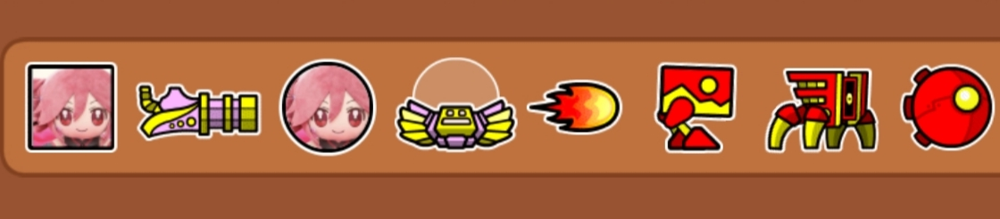

# teto-icons
The iconset i play with in GD

### For Now:
- only cube + ball

## How to get:
- install Geode
- install Texture Loader (the mod) and More Icons mod too
- install Textures Workshop gd mod
- open it, search Teto there, install
- Then open gd, Settings > Graphics > Textures > Drag the Teto Cube from left to right, click Apply

### Android + Linux soon
